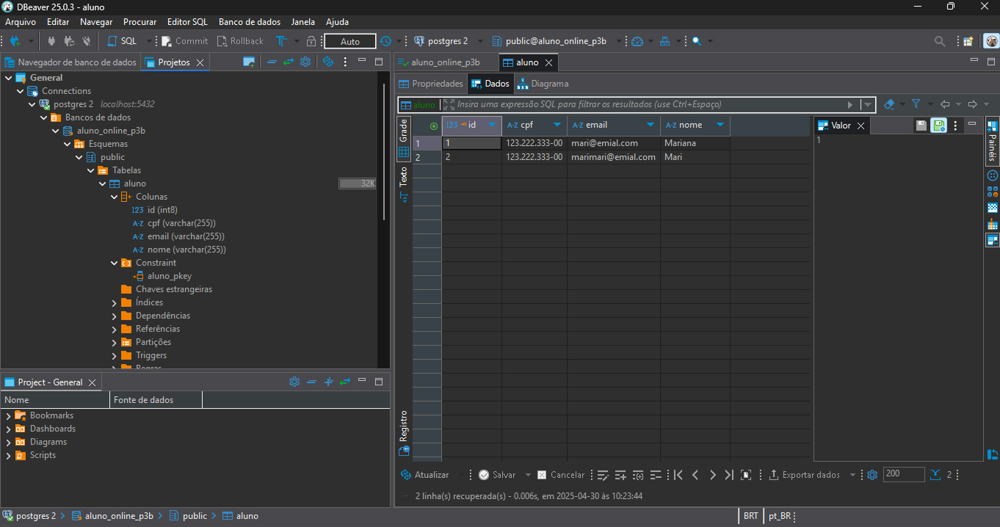
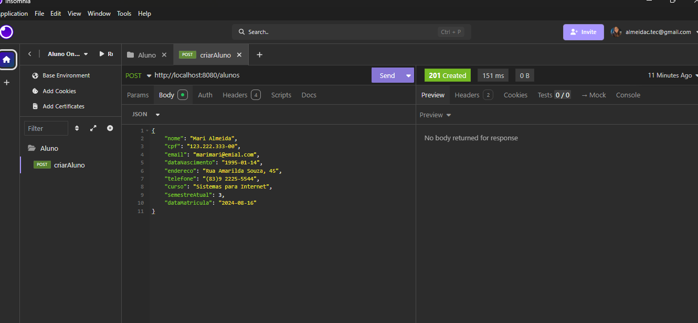
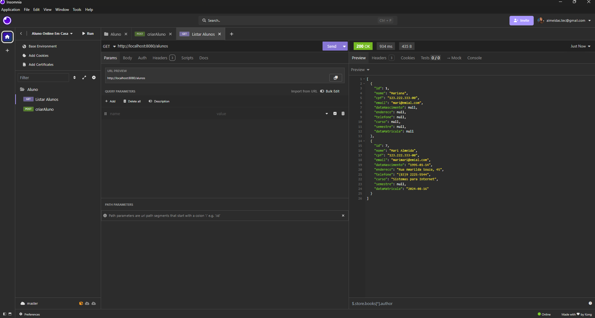
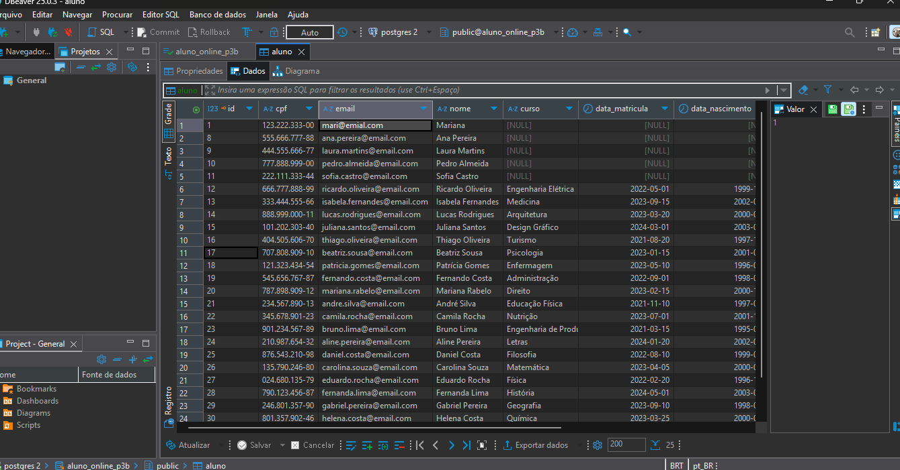
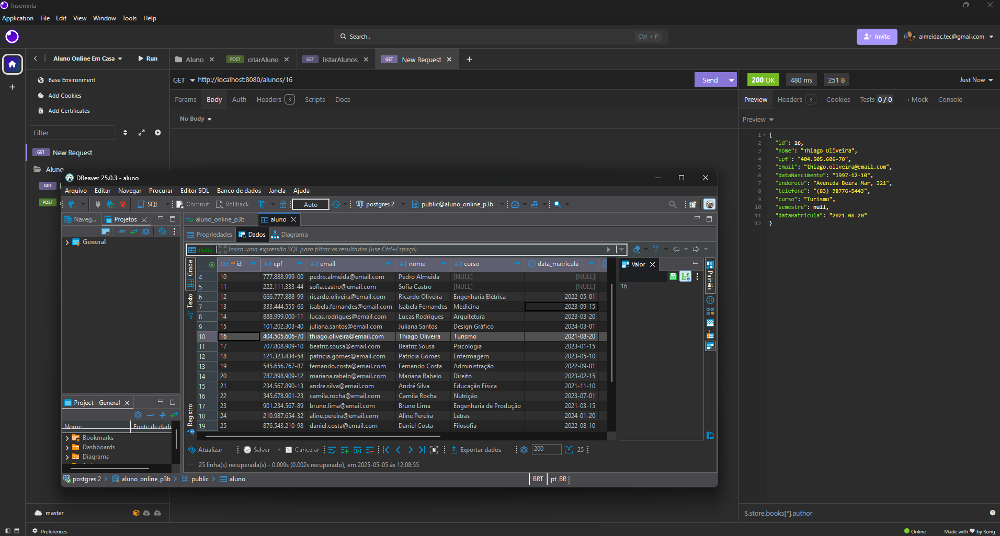
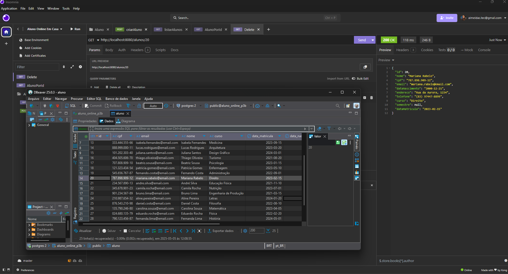

# Aluno Online API - Back-end

API de back-end para um sistema de gerenciamento acadêmico desenvolvida em Java/Spring.

## Funcionalidades Implementadas

### 1. Criação de Aluno (Básica):

Requisição para criar um aluno com informações básicas (nome, CPF, e-mail).

**Requisição (Insomnia/Postman):**


```json
{
    "nome": "Mari",
    "cpf": "123.222.333-00",
    "email": "marimari@emial.com"
}
```

**Resposta (Insomnia/Postman):**

Status `201 Created`.

**Resultado no Banco de Dados (DBeaver):**



### 2. Criação Detalhada de Aluno:

Requisição para criar um aluno com informações detalhadas(nome, CPF, e-mail, dataNascimento, endereço, telefone, curso, semestreAtual, dataMatricula).

**Requisição e Resposta (Insomnia/Postman):**


```json
{
    "nome": "Mari Almeida",
    "cpf": "123.222.333-00",
    "email": "marimari@emial.com",
    "dataNascimento": "1995-01-14",
    "endereco": "Rua Amarilda Souza, 45",
    "telefone": "(83)9 2225-5544",
    "curso": "Sistemas para Internet",
    "semestreAtual": 3,
    "dataMatricula": "2024-08-16"
}
```

**Resposta (Insomnia/Postman):**

Status `201 Created`.

**Resultado no Banco de Dados (DBeaver):**


### 3. Listar Todos os Alunos:

Requisição para listar todos os alunos cadastrados no sistema.

**Requisição (Insomnia/Postman):**



A requisição HTTP GET foi enviada para o endpoint `/alunos`, retornando todos os alunos cadastrados.

**Resposta (Insomnia/Postman):**

Status `200 OK`.

```json
[
  {
    "id": 1,
    "nome": "Mariana",
    "cpf": "123.222.333-00",
    "email": "mari@emial.com"
    // ... outros campos (podem ser null)
  },
  {
    "id": 7,
    "nome": "Mari Almeida",
    "cpf": "123.222.333-00",
    "email": "marimari@emial.com",
    "dataNascimento": "1995-01-14",
    "endereco": "Rua Amarilda Souza, 45",
    "telefone": "(83)9 2225-5544",
    "curso": "Sistemas para Internet",
    "semestreAtual": 3,
    "dataMatricula": "2024-08-16"
  },
]
```


**Resultado no Banco de Dados (DBeaver):**

Resultado da consulta SQL `SELECT * FROM aluno;` no banco de dados, onde é possível visualizar todos os alunos cadastrados.




### 4. Buscar Aluno por ID

Requisição para buscar um aluno específico no sistema através do seu identificador único (ID) (Ao fornecer o ID de um aluno cadastrado, a API retorna os detalhes desse aluno. Caso o ID fornecido não corresponda a nenhum aluno no sistema, a API retorna uma resposta indicando que o aluno não foi encontrado).

**Requisição para um aluno existente (Insomnia/Postman):**



Requisição HTTP GET foi enviada para o endpoint `/alunos/{id}` (16).

**Resposta para um aluno existente (Insomnia/Postman):**

Status `200 OK`.

```json
{
    "id": 16,
    "nome": "Thiago Oliveira",
    "cpf": "404.505.606-70",
    "email": "thiago.oliveira@email.com",
    "dataNascimento": "1997-12-10",
    "endereco": "Avenida Beira Mar, 321",
    "telefone": "(83) 98776-5443",
    "curso": "Turismo",
    "semestreAtual": 8,
    "dataMatricula": "2021-08-20"
}
```

### 5. Deletar Aluno por ID:

Requisição para deletar um aluno específico do sistema através do seu identificador único (ID).




A requisição HTTP DELETE foi enviada para o endpoint `/alunos/{id}`.

Status `204 No Content`.


